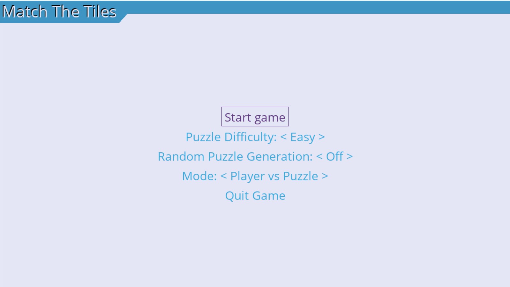

# IART Grupo 34

## Autores

Caio Nogueira - up201806218;

Carlos Lousada - up201806302;

Miguel Silva - up201806388.

## Instruções de configuração

Para este trabalho é necessário a versão de python 3.4 ou mais recente, para além do pygame e pygame menu.

Para instalar o pygame num computador com o python já instalado basta correr o comando: 

`pip install pygame`

Para instalar o pygame menu basta correr o comando:
`pip install pygame-menu`

## Instruções de execução

Para correr o programa basta correr o comando `python matchthetiles.py` dentro da pasta src.

Na abertura do programa o utilizador vê a seguinte tela.

Aqui o utilizador pode escolher a dificuldade do puzzle, se quer que seja gerado um puzzle random e o modo de jogo.

Se o modo escolhido for AI vs Puzzle o utlizador terá também a opção de escolher qual o algoritmo utilizado para chegar à solução bem como se quer visualizar o número de blocos de memória usados.